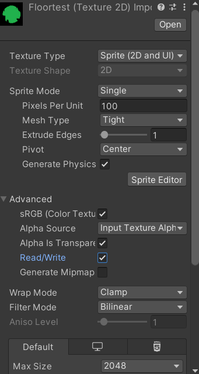

# 2D Sprite To 3D Model Generator

Makes 2D Sprite to 3D Model Mesh/Prefab directly inside Unity. 

> **⚠️ Important:** Make sure to allow **Read/Write access** on your sprites/textures for everything to work properly.

---

### 📸 Previews

 

 

